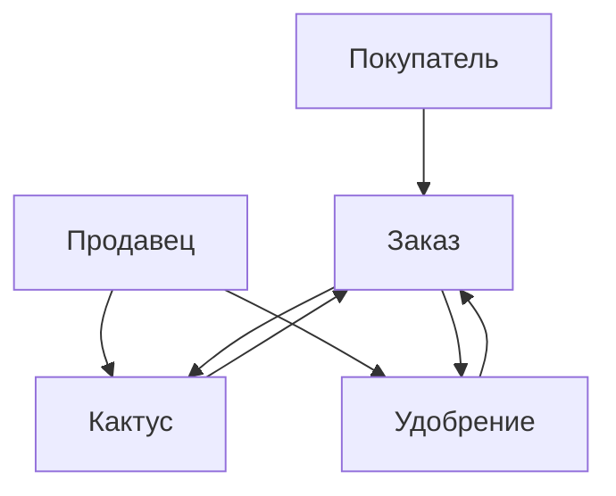

# cu-domain-driven-design-java

Репозиторий для заданий с буткемпа

```mermaid
flowchart TD
    A[Покупатель] --> B[Заказ]
    C[Продавец] --> D[Кактус]
    C --> E[Удобрение]
    B --> D
    B --> E
    D --> B
    E --> B
    
    classDef title fill:#f0a,stroke:#000,stroke-width:2px;
    classDef entity fill:#1a1a1a,stroke:#fff,stroke-width:2px;
    classDef relation fill:#333,stroke:#fff,stroke-width:2px;
```